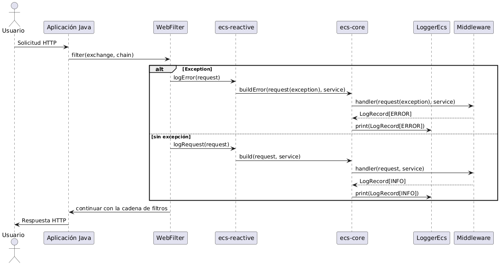

# Java ECS Library


A comprehensive Java library that enables structured logging in ECS (Elastic Common Schema) format, providing standardized log output for better observability and monitoring in Java applications.

## **General description**

The **ECS Logging Library** is a Java-based library designed to generate structured logs compliant with the `Elastic Common Schema (ECS)` format. It supports both imperative and reactive programming paradigms for Java projects generated from templates (scaffolds). The library simplifies the creation of logs following a predefined schema, enabling consistent and efficient analysis of request, response, and error logs.

## **Modules**
The library is composed of four main modules:

**ecs-model:** Defines the data structures and schema required for logs to comply with the ECS standard. This module serves as a dependency for the other modules.
**ecs-core:** Contains the core logic for building logs in ECS format, using *ecs-model* for schema definitions.
**ecs-imperative:** Provides logging functionality for projects following an imperative programming approach, leveraging *ecs-core*.
**ecs-reactive:** Provides logging functionality for projects following a reactive programming approach (e.g., Project Reactor), also leveraging *ecs-core*.

## **Prerequisites**

**Java:** Version 17 or higher.
**Gradle:** For dependency management.

## Getting Started

**IMPORTANT:** To implement the library in reactive projects, you must have a global error handler in the project and not control the exception at the handler level. This is because when the error is controlled internally in each handler, the response is no longer propagated to the library as an error, generating unexpected log prints.

If the global exception handler cannot be implemented, the imperative library must be used in the project.

Example of error control at the handler level:

``` java
return validateHeader.handler(request)
    .flatMap(metaData -> process(request, metaData))
    .onErrorResume(BusinessException.class, exception ->
        handlerResponse.createErrorResponse(exception, request))
    .onErrorResume(handlerResponse::runtimeException);
```


## Importing the Library
To use the ECS Logging Library in a Java project, add the corresponding dependencies to your `build.gradle` (Gradle) file.

For imperative projects:
```gradle
dependencies {
    implementation ':ecs-imperative:<version>'
}
````
For reactive projects:
```gradle
dependencies {
    implementation ':ecs-reactive:<version>'
}
````
For the model:
```gradle
dependencies {
    implementation ':ecs-model:<version>'
}
````

### Imperative/Reactive Projects

**Add Dependency:** Include `ecs-model` in the main `main.gradle` as shown below.

```
subprojects {  
	apply plugin: 'java'  
	apply plugin: 'jacoco'  
	apply plugin: 'io.spring.dependency-management'  
	apply plugin: 'info.solidsoft.pitest'
	compileJava.dependsOn validateStructure  

	java {  
	   sourceCompatibility = JavaVersion.VERSION_17  
	   targetCompatibility = JavaVersion.VERSION_17  
	}  

	//build.dependsOn 'pitest'  

	test {  
	   useJUnitPlatform()  
	}  

	dependencies {  
		...  

		implementation ':ecs-model:<version>'  
	}
}
```

Configure the library in **whitelistedDependencies** to avoid errors in the **validate-structure** task for scaffold projects, in the `main.gradle` file.
[validate-structure](https://bancolombia.github.io/scaffold-clean-architecture/docs/tasks/validate-structure)

```gradle
cleanPlugin {  
    modelProps {  
        whitelistedDependencies = "ecs-model"  
    }  
}
```

Link for more information about [validate-structure](https://bancolombia.github.io/scaffold-clean-architecture/docs/tasks/validate-structure)

In the exception class example `BusinessException` or `AppException`, you must extend the `BusinessExceptionECS` class from the library model.
Example:

```
import ecs.model.management.BusinessExceptionECS; 

public class BusinessException extends BusinessExceptionECS {  
    ...
  
    public BusinessException(ConstantBusinessException value) {  
        super(value);  
    } 
    ... 

 }
```


In the exception constant class, the `ConstantBusinessException` example must implement the `ErrorManagement` interface of the library model.
Example:

```
import ecs.model.management.ErrorManagement;  

public enum ConstantBusinessException implements ErrorManagement {

}
```

### Imperative Projects

**Add Dependency:** Include `ecs-imperative` in the `build.gradle` of the application module where the Main application is located, as shown below.

```
dependencies {  
	... 

	implementation ':ecs-imperative:<version>'  
}       
```

Import the configuration of `ImperativeLogsConfiguration` into the main class:

```
import ecs.application.ImperativeLogsConfiguration;  
import org.springframework.boot.SpringApplication;  
import org.springframework.boot.autoconfigure.SpringBootApplication;  
import org.springframework.boot.context.properties.ConfigurationPropertiesScan;  
import org.springframework.context.annotation.Import;  
  
@SpringBootApplication  
@ConfigurationPropertiesScan  
@Import(ImperativeLogsConfiguration.class)  
public class MainApplication {  
    public static void main(String[] args) {  
        SpringApplication.run(MainApplication.class, args);  
    }  
}
```

### Reactive Projects

**Add Dependency:** Include `ecs-reactive` in the `build.gradle` of the application module where the Main application is located, as shown below.

```
dependencies {  
	... 

	implementation ':ecs-reactive:<version>'  
}       
```

Import the configuration of `ReactiveLogsConfiguration` into the main class:

```

import ecs.application.ReactiveLogsConfiguration;  
import org.springframework.boot.SpringApplication;  
import org.springframework.boot.autoconfigure.SpringBootApplication;  
import org.springframework.boot.context.properties.ConfigurationPropertiesScan;  
import org.springframework.context.annotation.Import;  
  
@SpringBootApplication  
@ConfigurationPropertiesScan  
@Import(ReactiveLogsConfiguration.class)  
public class MainApplication {  
    public static void main(String[] args) {  
        SpringApplication.run(MainApplication.class, args);  
    }  
}
```

**Output:** Logs are generated across all REST requests and application errors in JSON ECS format.

## Log contract structure:


# ECS environment variables

**`Default variables`**

```yaml
adapter:
  ecs:
    logs:
      request:
        replacement: ""
        patterns: ""
        delimiter: ""
        fields: ""
        allow-headers: ""
        excluded-paths: "/actuator"
        show: false
      response:
        replacement: ""
        delimiter: ""
        fields: ""
        patterns: ""
        show: false
      sampling:
        rules20XJson: ""
        rules40XJson: ""
      sensitive-rules:  
        sensitive-data: ""
```


| Environment Variable | Description | Default Value |
| :--- | :--- | :--- |
| `adapter.ecs.logs.request.replacement` | Replacements for fields in request logs | “” |
| `adapter.ecs.logs.request.patterns` | Patterns to filter the JSON of requests | “” |
| `adapter.ecs.logs.request.delimiter` | Delimiter used to separate fields in request variables | “” |
| `adapter.ecs.logs.request.fields` | Fields to sanitize in request logs | “” |
| `adapter.ecs.logs.request.allow-headers` | HTTP headers allowed to include in request logs | “” |
| `adapter.ecs.logs.request.excluded-paths` | Paths excluded from request logging | “/actuator” |
| `adapter.ecs.logs.request.show` | Indicates whether request logs should be displayed | false |
| `adapter.ecs.logs.response.replacement` | Replacements for fields in response logs | “” |
| `adapter.ecs.logs.response.delimiter` | Delimiter used to separate fields from response variables | “” |
| `adapter.ecs.logs.response.fields` | Fields to apply sanitization to in response logs | “” |
| `adapter.ecs.logs.response.patterns` | Patterns to search for in response logs | “” |
| `adapter.ecs.logs.response.show` | Indicates whether response logs should be displayed | false |
| `adapter.ecs.logs.sampling.rules20XJson` | List of sampling rules for HTTP 20X response codes in Json format | “”|
| `adapter.ecs.logs.sampling.rules40XJson` | List of sampling rules for HTTP 40X response codes in JSON format | “”|
| `adapter.ecs.logs.sensitive-rules.sensitive-data` | List of rules for masking sensitive information by path | “” |
---

# ECS Logging Scheme Contract

Definition of the structure of logs generated by the ECS Logging Library. The structure of logs for the `INFO` and `ERROR` levels is described below, specifying the fields, their data types, and whether they are mandatory.

---

## General Log Structure

| Field           | Data Type     | Description                                                      | Required |
|-----------------|---------------|------------------------------------------------------------------|----------|
| messageId       | String (UUID) | Unique message identifier in UUID format.                        | Yes      |
| date            | String        | Date and time of the event in `DD/MM/YYYY HH:MM:SS:SSSS` format. | Yes      |
| service         | String        | Name of the service that generates the log (e.g., `ms_person`).  | Yes      |
| consumer        | String        | Identifier of the consumer or client making the request.         | Yes      |
| additionalInfo  | Object        | Additional information about the request (see details below).    | Yes      |
| level           | String        | Log level (`INFO` or `ERROR`).                                   | Yes      |
| error           | Object/Null   | Error details (present in `ERROR` logs, `null` in `INFO`).       | No       |

---


## Sequence Diagram

### Reactive Java



---

### Imperative Java


## Contributing

We welcome contributions! Please follow these steps:

1. **Fork** the repository
2. **Create a feature branch**
   ```bash
   git checkout -b feature/amazing-feature
    ```
3. Make your changes
4. Add tests for new functionality
5. Ensure all tests pass
    ``` bash
   ./gradlew test
    ```
6. Commit your changes
    ```bash
   git commit -m 'feat(user_module): Add amazing feature'
    ```
7. Push to the branch
    ```bash
   git push origin feature/amazing-feature
    ```
8. Open a **Pull Request**

### Development Guidelines

- Follow Java naming conventions
- Write comprehensive tests for new features
- Update documentation for API changes
- Ensure code passes all quality checks
- Add typespecs for public functions
