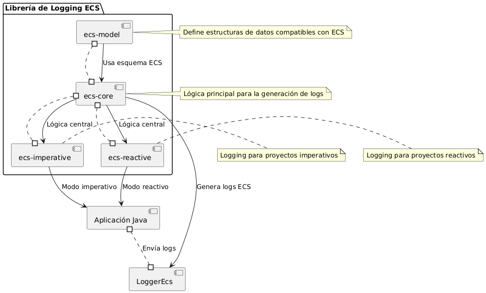
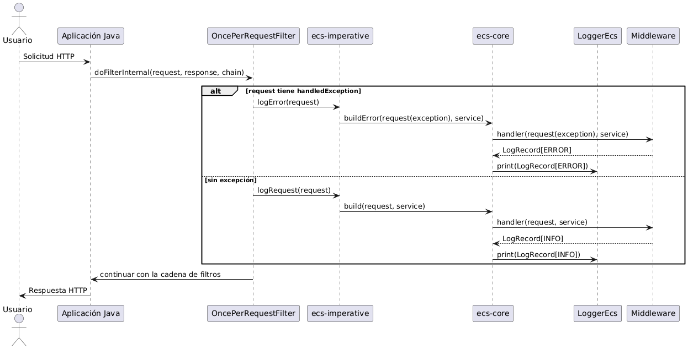

# Librería de Logging ECS



# **Descripción General**

La **Librería de Logging ECS** es una biblioteca basada en Java diseñada para generar logs estructurados que cumplen con el formato del `Elastic Common Schema (ECS)`. Soporta los paradigmas de programación imperativa y reactiva, para proyectos Java generados a partir de plantillas (scaffold). La biblioteca facilita la generación de logs con un esquema previamente definido, permitiendo un y análisis de los logs de request/response/error.

## **Módulos**
La librería está compuesta por cuatro módulos principales:

**ecs-model:** Define las estructuras de datos y el esquema necesario para que los logs cumplan con el estándar ECS. Este módulo es una dependencia para los demás módulos.
**ecs-core:** Contiene la lógica central para construir logs en formato ECS, utilizando ecs-model para las definiciones de esquema.
**ecs-imperative:** Proporciona funcionalidad de logging para proyectos que siguen un enfoque de programación imperativa, utilizando ecs-core.
**ecs-reactive:** Proporciona funcionalidad de logging para proyectos que siguen un enfoque de programación reactiva (ej. Project Reactor), también utilizando ecs-core.

## **Prerrequisitos**

**Java:** Versión 17 o superior.
**Gradle:** Para la gestión de dependencias.
**Azure DevOps:** Para pipelines de CI/CD.

## Uso en Proyectos generados con Scaffold

La Librería de Logging ECS está diseñada para integrarse fácilmente en proyectos Java.

### Proyectos Imperativos/Reactivo

**Agregar Dependencia:** Incluye `ecs-model` en el `main.gradle` principal como se muestra posteriomente.

```
subprojects {  
	apply plugin: 'java'  
	apply plugin: 'jacoco'  
	apply plugin: 'io.spring.dependency-management'  
	apply plugin: 'info.solidsoft.pitest'
	compileJava.dependsOn validateStructure  

	java {  
	   sourceCompatibility = JavaVersion.VERSION_17  
	   targetCompatibility = JavaVersion.VERSION_17  
	}  

	//build.dependsOn 'pitest'  

	test {  
	   useJUnitPlatform()  
	}  

	dependencies {  
		...  

		implementation 'co.com.bancolombia:ecs-model:0.0.8-test'  
	}
}
```

Configurar en el **whitelistedDependencies** la librería para evitar el error en la tarea de **validate-structure** de scaffold
[validate-structure](https://bancolombia.github.io/scaffold-clean-architecture/docs/tasks/validate-structure)

En la clase de excepción ejemplo `BusinessException` o `AppException` debe extender de la clase `BusinessExceptionECS` del modelo de la librería
ejemplo:


```
package co.com.bancolombia.model.exception;  
  
import co.com.bancolombia.ecs.model.management.BusinessExceptionECS;  
  
public class BusinessException extends BusinessExceptionECS {  
 
    ...
  
    public BusinessException(ConstantBusinessException value) {  
        super(value);  
    } 
    ... 

 }
```


En la clase de las constantes de las excepciones ejemplo `ConstantBusinessException`  debe implementar la interfaz `ErrorManagement` del modelo de la librería
ejemplo:

```
package co.com.bancolombia.model.exception;  
  
import co.com.bancolombia.ecs.model.management.ErrorManagement;  
   
import static java.net.HttpURLConnection.HTTP_INTERNAL_ERROR;  
  
public enum ConstantBusinessException implements ErrorManagement {

    ...
    DEFAULT_EXCEPTION(HTTP_INTERNAL_ERROR,  
        CodeMessage.INITIAL_CODE_DETAIL,  
        BusinessCode.BASIC_INITIAL_CODE,  
        InternalMessage.TECHNICAL_ERROR,  
        CodeLog.LOG500_00),
   ...

}
```

### Proyectos Imperativos

**Agregar Dependencia:** Incluye `ecs-imperative` en el `build.gradle` del modulo de aplicación donde se encuentra el Main application como se muestra posteriomente.

```
dependencies {  
	... 

	implementation 'co.com.bancolombia:ecs-imperative:0.0.8'  
}       
```

Importar la configuracion de el `ImperativeLogsConfiguration` en la clase de main principal:

```
package co.com.bancolombia;  
  
import co.com.bancolombia.ecs.application.ImperativeLogsConfiguration;  
import org.springframework.boot.SpringApplication;  
import org.springframework.boot.autoconfigure.SpringBootApplication;  
import org.springframework.boot.context.properties.ConfigurationPropertiesScan;  
import org.springframework.context.annotation.Import;  
  
@SpringBootApplication  
@ConfigurationPropertiesScan  
@Import(ImperativeLogsConfiguration.class)  
public class MainApplication {  
    public static void main(String[] args) {  
        SpringApplication.run(MainApplication.class, args);  
    }  
}
```

### Proyectos Reactivos

**Agregar Dependencia:** Incluye `ecs-reactive` en el `build.gradle` del modulo de aplicación donde se encuentra el Main application como se muestra posteriomente.

```
dependencies {  
	... 

	implementation 'co.com.bancolombia:ecs-reactive:0.0.8'  
}       
```

Importar la configuracion de el `ReactiveLogsConfiguration` en la clase de main principal:

```
package co.com.bancolombia;  
  
import co.com.bancolombia.ecs.application.ReactiveLogsConfiguration;  
import org.springframework.boot.SpringApplication;  
import org.springframework.boot.autoconfigure.SpringBootApplication;  
import org.springframework.boot.context.properties.ConfigurationPropertiesScan;  
import org.springframework.context.annotation.Import;  
  
@SpringBootApplication  
@ConfigurationPropertiesScan  
@Import(ReactiveLogsConfiguration.class)  
public class MainApplication {  
    public static void main(String[] args) {  
        SpringApplication.run(MainApplication.class, args);  
    }  
}
```

**Salida:** Los logs se generan de manera transversal a todas las peticiones rest y errores del aplicativo en formato JSON ECS.

## Estructura del contrato de los logs:


# Variables de entorno ECS

**`Variables por default`**

```
spring:

  application:

    name: "ms_ecs"

  ecs:

    logs:

      request:

        replacement: ""

        patterns: ""

        delimiter: ""

        fields: ""

        allow-headers: ""

        excluded-paths: "/actuator"

        show: false

      response:

        replacement: ""

        delimiter: ""

        fields: ""

        patterns: ""

        show: false
```

| Variable de Entorno | Descripción | Valor por Defecto |
| --- | --- | --- |
| `spring.application.name` | Nombre del servicio | "ms_ecs" |
| `spring.ecs.logs.request.replacement` | Reemplazos para campos en los logs de solicitudes | "" |
| `spring.ecs.logs.request.patterns` | Patrones a filtrar el json de las solicitudes | "" |
| `spring.ecs.logs.request.delimiter` | Delimitador utilizado para separar campos en las variables de solicitudes | "" |
| `spring.ecs.logs.request.fields` | Campos a aplicar la sanitización en los logs de solicitudes | "" |
| `spring.ecs.logs.request.allow-headers` | Encabezados HTTP permitidos para incluir en los logs de solicitudes | "" |
| `spring.ecs.logs.request.excluded-paths` | Rutas excluidas del registro de solicitudes | "/actuator" |
| `spring.ecs.logs.request.show` | Indica si se deben mostrar los logs de las solicitudes | false |
| `spring.ecs.logs.response.replacement` | Reemplazos para campos en los logs de respuestas | "" |
| `spring.ecs.logs.response.delimiter` | Delimitador utilizado para separar campos de las variables de respuestas | "" |
| `spring.ecs.logs.response.fields` | Campos a aplicar la sanitización en los logs de respuestas | "" |
| `spring.ecs.logs.response.patterns` | Patrones a buscar en los logs de respuestas | "" |
| `spring.ecs.logs.response.show` | Indica si se deben mostrar los logs de las respuestas | false |


# Contrato del Esquema de Logs ECS

Definición de la estructura de los logs generados por la Librería de Logging ECS. A continuación, se describe la estructura de los logs para los niveles `INFO` y `ERROR`, especificando los campos, sus tipos de datos y su obligatoriedad.

---

## Estructura General del Log

| Campo        | Tipo de Dato  | Descripción                                                      | Obligatorio |
|--------------|---------------|------------------------------------------------------------------|-------------|
| messageId    | String (UUID) | Identificador único del mensaje en formato UUID.                 | Sí          |
| date         | String        | Fecha y hora del evento en formato `DD/MM/YYYY HH:MM:SS:SSSS`.   | Sí          |
| service      | String        | Nombre del servicio que genera el log (ej. `ms_actor`).          | Sí          |
| consumer     | String        | Identificador del consumidor o cliente que realiza la solicitud. | Sí          |
| additionalInfo | Object      | Información adicional sobre la solicitud (ver detalle abajo).    | Sí          |
| level        | String        | Nivel del log (`INFO` o `ERROR`).                                | Sí          |
| error        | Object/Null   | Detalles del error (presente en logs `ERROR`, `null` en `INFO`). | No          |

---

## Detalle de `additionalInfo`

### Campos principales

| Campo         | Tipo de Dato | Descripción                                        | Obligatorio | Notas                         |
|---------------|--------------|----------------------------------------------------|-------------|-------------------------------|
| method        | String       | Método HTTP utilizado (ej. `POST`, `GET`).         | Sí          |                               |
| uri           | String       | URI de la solicitud (ej. `/actors/retrieveUser`).  | Sí          |                               |
| headers       | Object       | Cabeceras HTTP de la solicitud.                    | Sí          | Ver detalle de subcampos.     |
| requestBody   | Object       | Cuerpo de la solicitud.                            | Sí          | Varía según el tipo de log.   |
| responseBody  | Object/Null  | Cuerpo de la respuesta.                            | No          | Presente en logs `INFO`.      |
| responseResult| String       | Resultado de la respuesta (ej. `OK`).              | Sí          |                               |
| responseCode  | String       | Código de estado HTTP (ej. `200`, `400`).          | Sí          |                               |

---

### Subcampos de `headers`

| Campo        | Tipo de Dato  | Descripción                                                   | Obligatorio | Notas                                  |
|--------------|---------------|---------------------------------------------------------------|-------------|----------------------------------------|
| code         | String        | Código del consumidor (ej. `CAP`).                            | No          | Coincide con `consumer` en la raíz.    |
| message-id   | String (UUID) | Identificador del mensaje.                                    | Sí          | Coincide con `messageId` en la raíz.   |
| aid-creator  | String        | Identificador del creador.                                    | No          | Ej. `A8A77339260DA412B8238F21BBC1CF398`|

---

### Subcampos de `requestBody`

#### Para logs en el que nos e puede convertir el body en json

| Campo | Tipo de Dato | Descripción                                    | Obligatorio |
|-------|--------------|------------------------------------------------|-------------|
| raw   | String       | Cuerpo de la solicitud como texto plano.       | No          |


| Campo                 | Tipo de Dato | Descripción                                                 | Obligatorio |
|-----------------------|--------------|-------------------------------------------------------------|-------------|
| meta                  | Object       | Metadatos de la respuesta.                                  | No          |
| meta._messageId       | String (UUID)| Identificador único del mensaje.                            | No          |
| meta._requestDateTime | String       | Fecha y hora de la solicitud.                               | No          |
| data                  | Object       | Datos de la respuesta.                                      | No          |

---

### Subcampos de `responseBody` (Solo logs `INFO`)

#### Para logs en el que nos e puede convertir el body en json

| Campo | Tipo de Dato | Descripción                                    | Obligatorio |
|-------|--------------|------------------------------------------------|-------------|
| raw   | String       | Cuerpo de la solicitud como texto plano.       | No          |


| Campo                 | Tipo de Dato | Descripción                                                 | Obligatorio |
|-----------------------|--------------|-------------------------------------------------------------|-------------|
| meta                  | Object       | Metadatos de la respuesta.                                  | No          |
| meta._messageId       | String (UUID)| Identificador único del mensaje.                            | No          |
| meta._requestDateTime | String       | Fecha y hora de la solicitud.                               | No          |
| data                  | Object       | Datos de la respuesta.                                      | No          |

---

## Detalle de `error` (Solo logs `ERROR`)

| Campo         | Tipo de Dato | Descripción                                         | Obligatorio |
|---------------|--------------|-----------------------------------------------------|-------------|
| type          | String       | Código del error (ej. `SAER400-01-11`).             | Sí          |
| message       | String       | Mensaje descriptivo del error.                      | Sí          |
| description   | String       | Descripción detallada del error.                    | Sí          |
| optionalInfo  | Object       | Información adicional del error.                    | No          |
| optionalInfo.OPTIONAL | String | Detalle adicional. Ej. falta de cabeceras.         | No          |

---

## Diagrama de Secuencia

### Java Reactivo


---

### Java Imperativo

